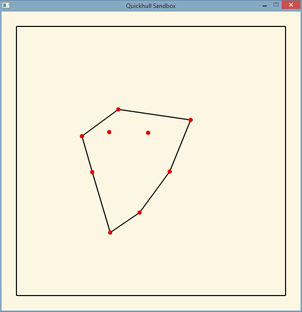

# alg-quickhull

Assignment for Algorithms VT15P4 (21AL1B)

Implementation of the quickhull algorithm + Akl-Toussaint heuristic for realtime visualization and comparison of efficiency. Enjoy!

This was actually an assignment, hence the documentation and source comments are in Swedish. If you're interested in a translation, drop me a message.

Philip Arvidsson 
University of Borås, Sweden
