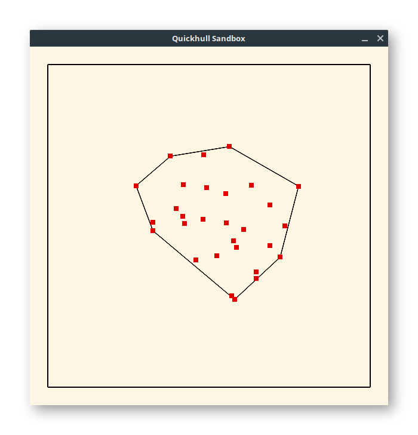
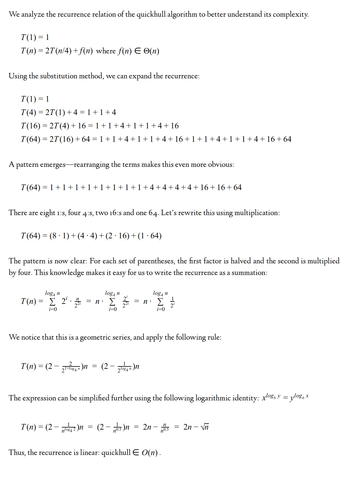

# Examining the Quickhull Algorithm

Assignment for the Algorithms VT15P4 (21AL1B) course.

Implementation of the quickhull algorithm + Akl-Toussaint heuristic for realtime visualization and comparison of efficiency. Enjoy!

This was actually an assignment, hence the documentation and source code comments are in Swedish. If you're interested in a translation, drop me a message!



## Settings

    KEYS
    ----------------
    Key    Effect

      a    Toggles Akl-Toussaint heuristic.
      b    Toggles black hole (gravity towards center).
      d    Toggles damping.
      f    Toggles sloped floor.
      g    Toggles gravity.
      h    Toggles hull rendering.
      l    Toggles hull lock (locks hull to its current point set).
      p    Toggles point rendering.
      q    Toggles between bruteforce and quickhull.
      r    Toggles rubber band mode (hull becomes a rubber band).
      w    Toggles wind.
      x    Randomizes point velocities.
      z    Randomizes point positions.
    ----------------

## Building

### Linux

```bash
sudo apt -qqy install git lib-common-mesa libgl1-mesa-dev
git clone https://github.com/philiparvidsson/quickhull-algorithm.git
cd quickhull-algorithm
make
```

## Quickhull is linear!

What follows is a proof of quickhull having linear complexity for random inputs:




**Philip Arvidsson**<br/>
*University of Borås, Sweden*
